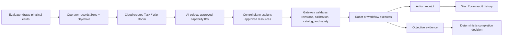

# Portable robot Mission Stations

Mission Stations is a portable demonstration of Flyto2's task, resource,
capability, decision, and evidence architecture. It uses four movable stations
instead of a fixed arena, so the same system can be set up in a different open
space without changing hard-coded coordinates.

## Who draws the cards?

The evaluator physically draws one Zone card and one Objective card. The
operator records the exact pair in Mission Control with
`card_source=judge_draw`.

Flyto2 does not draw, shuffle, randomize, recommend, or silently replace those
cards. The recorded pair is authoritative for the task goal, required
capability IDs, and permitted objective evidence.

## Portable physical kit

A practical station can use 5 mm white PP corrugated board, also called PP
hollow sheet or Coroplast. A suggested display panel is about 35 by 25 cm with
8-10 cm fold-in wings. Half-cut fold lines and reusable hook-and-loop or
Dual Lock fasteners let each station stand for the demo and fold flat for
transport.

The portable kit consists of:

- four fold-flat stations labeled `Z1`, `Z2`, `Z3`, and `Z4`;
- one separate `START` marker;
- large AprilTags for machine-readable station identity;
- a robot with LiDAR and a forward UVC camera;
- an overhead USB camera when venue-wide observation is useful;
- removable obstacles for passage-clearance objectives; and
- the evaluator's physical Zone and Objective cards.

The board dimensions are a demo recommendation, not a runtime coordinate
contract. The station identities and calibration are the durable interface.

## Calibrate the venue

Each setup resolves `Z1` through `Z4` and `START` into a fresh calibration
snapshot. Positions may come from AprilTag detection, overhead-camera
registration, or explicit operator clicks. Mission creation remains blocked
until every required marker is ready.

```text
[Z1]                    [Z2]

             START

[Z3]                    [Z4]
```

The diagram is illustrative. Distance and orientation are deliberately not
fixed, which proves the task is bound to discovered venue state rather than a
demo-only floor map.

## Built-in zones and objectives

| Zone | Scenario | Typical capability |
| --- | --- | --- |
| `Z1` | Public observation | `zone.overview` |
| `Z2` | Occluded or dead-angle inspection | `zone.overview` from a mobile viewpoint |
| `Z3` | Restricted review | approval plus observation/identifier evidence |
| `Z4` | Passage and clearance inspection | `passage.clearance` |

Objective cards can request anomaly observation, passage clearance, asset
identification, or controlled review. The card defines the evidence kinds that
must be present; it does not name a specific robot or camera.

## Task and resource flow



One task maps to one War Room history. Plan revisions describe how the
capabilities should be used. Assignment revisions separately bind exact
resources. Both histories are append-only so a resource swap does not rewrite
the plan and a plan change does not erase which resource was used.

## Capability approval

A device may declare capabilities, but declaration is not approval. A
versioned registry moves a declaration through `DISCOVERED` and then
`APPROVED` or `REJECTED`. Dispatch references the approved registry hash and an
explicit executor kind; no component infers a motor controller from a device
name.

Flyto2 AI receives only the recorded card facts and the approved capability
list. It may return a bounded reading, selected approved capability IDs, and a
clarification request. Invalid, hostile, unavailable, or out-of-contract model
output falls back to deterministic card requirements.

## Evidence and completion

Action success and task success are separate facts:

- `action.execution` records that an approved action ran and is always
  `task_completion_eligible=false`;
- the Objective card's required evidence kinds are the only completion input;
- missing evidence produces an explicit incomplete or escalation state; and
- a valid measurement may complete an objective with a `BLOCKED` result.

For example, a passage card may require a clearance measurement. Measuring
0.37 m against a 0.60 m threshold is valid evidence even though the passage is
blocked. The task succeeds at inspection; it does not falsely report that the
passage is clear.

## Motion safety boundary

Cloud and the UI never expose raw motor-control fields. Motion dispatch must
use an approved capability, validated arguments, exact task/plan/assignment and
calibration revisions, a current capability-catalog hash, and a required
`safe_stop` terminator. The robotics gateway is a separate loopback service and
does not expose a remote motor endpoint.

An LLM is not a safety controller, lock manager, evidence authority, or task
completion authority.

## Current verification scope

The source implementation has focused Cloud backend/frontend tests, bounded AI
interpretation tests, robotics gateway/contract tests, generated documentation
checks, production frontend builds, and strict local index verification.
Authenticated browser evidence and a live calibrated Cloud-to-AI-to-Robotics
demonstration remain deployment/integration activities rather than facts this
page assumes.
